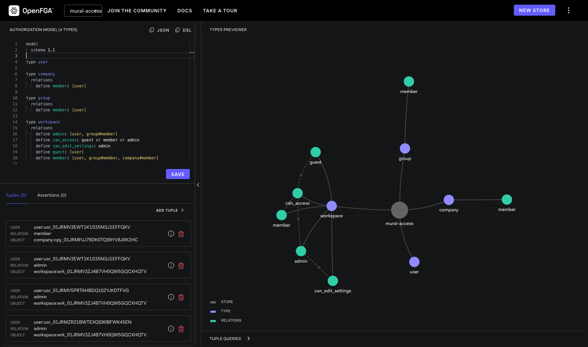

# Mural Access

Defining relations at [Mural](https://mural.co) with
[OpenFGA](https://openfga.dev).

## Setup

Checkout the repository

```sh
git clone https://github.com/mickaelpham/mural-access
```

Install the required dependencies

```sh
cd mural-access
npm install
```

Configure the environment variables (only `DATABASE_URL` is required for now)

```sh
cp .env.sample .env
nvim .env
```

Start the services

```sh
docker compose up -d
```

Migrate the application database

```sh
npx prisma migrate reset
```

## Authorization model

```
model
  schema 1.1

type user

type company
  relations
    define member: [user]

type group
  relations
    define member: [user]

type workspace
  relations
    define admin: [user, group#member]
    define can_access: guest or member or admin
    define can_edit_settings: admin
    define guest: [user]
    define member: [user, group#member, company#member]
```

1. Open the playground at http://localhost:3001/playground
2. Create a new store
3. Copy/paste the authorization model from above
4. Copy the store ID and add it to the `.env` file as `FGA_STORE_ID=`
5. Copy the last authorization model ID and add it as `FGA_MODEL_ID=`



## Demo

Start the server

```sh
npm run start:dev
```

Create a company

```sh
curl --location --request POST 'http://localhost:3000/companies' \
--header 'Content-Type: application/json' \
--data-raw '{
  "name": "Yankee company"
}'
```

Create a user within that company

```sh
curl --location --request POST 'http://localhost:3000/users' \
--header 'Content-Type: application/json' \
--data-raw '{
  "username": "another_user123",
  "displayName": "John Doe",
  "companyId": "<COMPANY_ID>"
}'

```

### Direct Relationship

Create a workspace with that user as an admin

```sh
curl --location --request POST 'http://localhost:3000/workspaces' \
--header 'Content-Type: application/json' \
--data-raw '{
  "adminUserId": "<USER_ID>",
  "workspaceName": "Marketing 101"
}'
```

Verify that the user can access the workspace

```sh
curl --location --request GET 'http://localhost:3000/workspaces/<WORKSPACE_ID>?as=<USER_ID>'
```

Verify that the user can edit the workspace name

```sh
curl --location --request PATCH 'http://localhost:3000/workspaces/<WORKSPACE_ID>' \
--header 'Content-Type: application/json' \
--data-raw '{
  "as": "<USER_ID>",
  "workspaceName": "Marketing 102"
}'
```

### User Groups

Create a group in that company

```sh
curl --location --request POST 'http://localhost:3000/groups' \
--header 'Content-Type: application/json' \
--data-raw '{
  "name": "Member group",
  "companyId": "<COMPANY_ID>"
}'
```

Create another user in the company

```sh
curl --location --request POST 'http://localhost:3000/users' \
--header 'Content-Type: application/json' \
--data-raw '{
  "username": "beta_demo4",
  "displayName": "Jane Ford",
  "companyId": "<COMPANY_ID>"
}'
```

Verify that the user **cannot** access the workspace

```sh
curl --location --request GET 'http://localhost:3000/workspaces/<WORKSPACE_ID>?as=<OTHER_USER_ID>'
# Response is HTTP 403 Forbidden
```

Add this user to the group

```sh
curl --location --request PATCH 'http://localhost:3000/groups/<GROUP_ID>>/users' \
--header 'Content-Type: application/json' \
--data-raw '[
  {
    "operation": "add",
    "userId": "<OTHER_USER_ID>"
  }
]'
```

Add the workspace to the group with the `MEMBER` role

```sh
curl --location --request PATCH 'http://localhost:3000/groups/<GROUP_ID>/workspaces' \
--header 'Content-Type: application/json' \
--data-raw '[
  {
    "operation": "add",
    "workspaceId": "<WORKSPACE_ID>",
    "role": "MEMBER"
  }
]'
```

Now the user **can** access the workspace

```sh
curl --location --request GET 'http://localhost:3000/workspaces/<WORKSPACE_ID>?as=<OTHER_USER_ID>'
# Response is HTTP 200 OK
```

And the user still **cannot** edit the workspace settings

```sh
curl --location --request PATCH 'http://localhost:3000/workspaces/<WORKSPACE_ID>' \
--header 'Content-Type: application/json' \
--data-raw '{
  "as": "<OTHER_USER_ID>",
  "workspaceName": "Marketing 103"
}'
# Response is HTTP 403 Forbidden
```

## Roadmap

- [ ] I still need to find a good way to un-delete entities. The query is funky.
- [ ] Room and mural are not handled today
